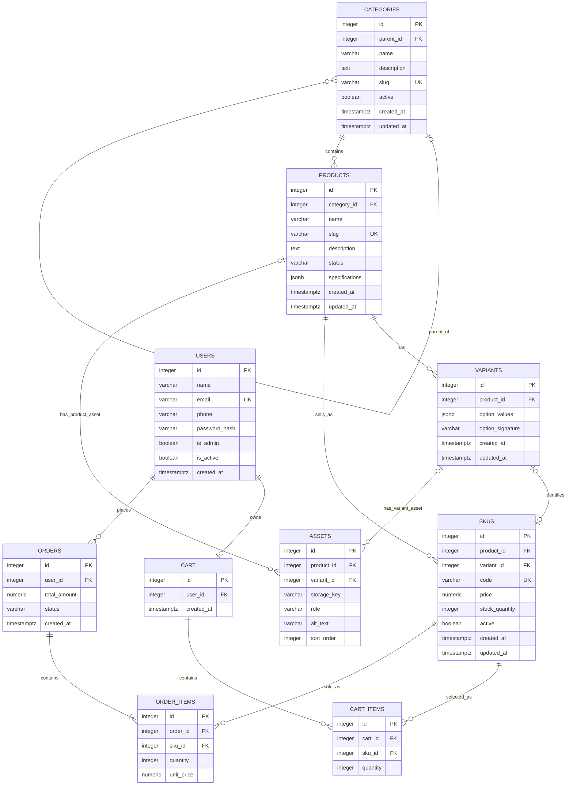

# Sprint 2 — Catalog Data Foundation

**Project:** ReadySafe — Emergency Preparedness E-Commerce Platform  
**Course:** E-Commerce  
**Department:** Institute of Mathematics and Computer Science (IMCS)  
**University:** University of Sindh, Jamshoro  
**Sprint:** Sprint 2 — Catalog Data Foundation  
**Stack:** React.js + FastAPI + PostgreSQL  
**Sprint 1 reference:** [docs/SPRINT_1.md](SPRINT_1.md)

---

## 1. Sprint goal and scope boundary

Sprint 1 described ReadySafe as a store for household emergency and safety products. In Sprint 2, the catalog moves from an ERD on paper to a backend that can actually store and manage categories, products, product variations, prices, and stock.

The important change in this sprint is that a **product** and a **sellable item** are no longer treated as the same thing. For example, “Rechargeable Emergency Lantern” is one product, while its Black/Rechargeable and Red/Rechargeable versions are separate sellable SKUs. This keeps price and inventory tied to the exact item that would later be placed in a cart.

| Area | Sprint 2 implementation |
|---|---|
| Categories | Parent/child category tree, unique slugs, active state, cycle prevention |
| Products | Name, slug, description, category, status, timestamps and JSON specifications |
| Variants | Valid option combinations such as `color=Black` + `power=Solar` |
| SKUs | Unique code, price, stock quantity and active state for the sellable item |
| Administration | Authenticated FastAPI routes for category, product, variant and SKU management |
| Data integrity | PostgreSQL foreign keys, uniqueness rules, checks and category-cycle protection |
| Seed data | Repeatable ReadySafe catalog with categories, products, variants and SKUs |
| Verification | Automated tests for normal behavior and rejection cases |

Sprint 2 does **not** implement the public storefront, product search, image upload, cart behavior, checkout, payment, shipping, or order placement. The database contains an `assets` table and a validated `specifications` field because they belong to the catalog model, but their full user-facing workflows are left for Sprint 3.

---

## 2. Sprint 1 decisions reused or changed

The Sprint 1 document is kept as submitted. Sprint 2 extends it instead of editing the old design after the fact.

| Sprint 1 decision | How it is handled in Sprint 2 |
|---|---|
| ReadySafe sells emergency and safety products | The seed catalog uses first-aid, emergency-lighting and water-preparedness products. |
| FastAPI backend | The administration API is implemented with FastAPI. |
| PostgreSQL | PostgreSQL remains the target database and Alembic migration dialect. |
| One category relationship on Product | A product still has one canonical category. Categories can now be nested. |
| Admin inventory management | Expanded into protected administration for categories, products, variants and SKUs. |
| Product price and stock were stored on `PRODUCTS` | Refined: price and stock now belong to `SKUS`, because different versions of one product may have different price or stock. |
| Cart and order lines referenced `product_id` | Sprint 2 does not build cart/order tables, but the updated design plans for line items to reference `sku_id` so Sprint 3 uses the exact sellable item. |

### Why SKU becomes the sellable identity

A simple ReadySafe product can still work without variants. The **Home First Aid Kit**, for example, has one SKU and no variant row. A product with choices uses variants. The **Rechargeable Emergency Lantern** has separate valid combinations for colour and power source, and each stored combination can have one SKU.

`variant_id` on a SKU is therefore optional, but `product_id` is always required. The database also prevents a SKU from pointing to a variant owned by a different product.

For future orders, `ORDER_ITEMS.unit_price` remains useful even after the move to SKU identity. It is intended to store the price paid at the time of the order rather than reading a later price from the catalog.

---

## 3. Updated ERD and data dictionary

The diagram below includes the Sprint 2 tables that are implemented now and the planned connection to the Sprint 1 cart/order entities. `CART`, `CART_ITEMS`, `ORDERS` and `ORDER_ITEMS` are shown for continuity but are not created by the Sprint 2 migration.

### 3.1 Entity-relationship diagram



### 3.2 Implemented catalog tables

#### `categories`

| Column | Type | Rule |
|---|---|---|
| `id` | `INTEGER` | Primary key |
| `parent_id` | `INTEGER NULL` | FK to `categories.id` |
| `name` | `VARCHAR(100)` | Required |
| `description` | `TEXT` | Required, defaults to empty text |
| `slug` | `VARCHAR(120)` | Required and unique |
| `active` | `BOOLEAN` | Required, defaults to `TRUE` |
| `created_at` | `TIMESTAMPTZ` | Database timestamp |
| `updated_at` | `TIMESTAMPTZ` | Database timestamp |

`parent_id` uses `ON UPDATE CASCADE` and `ON DELETE RESTRICT`. A check prevents a category from directly using itself as parent. A PostgreSQL trigger also walks the ancestor chain so an indirect cycle such as A → B → C → A cannot be saved.

#### `products`

| Column | Type | Rule |
|---|---|---|
| `id` | `INTEGER` | Primary key |
| `category_id` | `INTEGER` | FK to `categories.id`, required |
| `name` | `VARCHAR(150)` | Required |
| `slug` | `VARCHAR(180)` | Required and unique |
| `description` | `TEXT` | Required, defaults to empty text |
| `status` | `VARCHAR(20)` | `draft`, `published` or `inactive` |
| `specifications` | `JSONB` | Required JSON object, defaults to `{}` |
| `created_at` | `TIMESTAMPTZ` | Database timestamp |
| `updated_at` | `TIMESTAMPTZ` | Database timestamp |

`category_id` uses `ON UPDATE CASCADE` and `ON DELETE RESTRICT`. Products cannot be assigned to a category whose own `active` flag is false.

The `specifications` field is intentionally simple in Sprint 2. The API accepts at most 30 fields; keys must be 1–60 characters; nested objects are not accepted; and a list value may contain at most 20 primitive values. This gives ReadySafe enough room for values such as `runtime_hours`, `water_capacity_litres`, or `kit_piece_count` without introducing EAV tables in this sprint.

#### `variants`

| Column | Type | Rule |
|---|---|---|
| `id` | `INTEGER` | Primary key |
| `product_id` | `INTEGER` | FK to `products.id`, required |
| `option_values` | `JSONB` | Required object such as `{"color":"Black","power":"Solar"}` |
| `option_signature` | `VARCHAR(500)` | Normalized internal signature |
| `created_at` | `TIMESTAMPTZ` | Database timestamp |
| `updated_at` | `TIMESTAMPTZ` | Database timestamp |

`product_id` uses `ON UPDATE CASCADE` and `ON DELETE RESTRICT`. `(product_id, option_signature)` is unique, so the same combination cannot be entered twice for one product.

#### `skus`

| Column | Type | Rule |
|---|---|---|
| `id` | `INTEGER` | Primary key |
| `product_id` | `INTEGER` | FK to `products.id`, required |
| `variant_id` | `INTEGER NULL` | Optional FK to a variant of the same product |
| `code` | `VARCHAR(80)` | Required and globally unique |
| `price` | `NUMERIC(10,2)` | Required, must be `>= 0` |
| `stock_quantity` | `INTEGER` | Required, must be `>= 0` |
| `active` | `BOOLEAN` | Required, defaults to `TRUE` |
| `created_at` | `TIMESTAMPTZ` | Database timestamp |
| `updated_at` | `TIMESTAMPTZ` | Database timestamp |

The direct product FK and the composite `(variant_id, product_id)` FK both use `ON UPDATE CASCADE` and `ON DELETE RESTRICT`. `variant_id` is unique when present, so one stored variant combination maps to at most one SKU in the current model.

Money is stored as `NUMERIC(10,2)` rather than floating point. Stock has a database `CHECK` as well as API validation, so a direct database write cannot normally make stock negative.

#### `assets`

| Column | Type | Rule |
|---|---|---|
| `id` | `INTEGER` | Primary key |
| `product_id` | `INTEGER NULL` | FK to `products.id` |
| `variant_id` | `INTEGER NULL` | FK to `variants.id` |
| `storage_key` | `VARCHAR(500)` | Required |
| `role` | `VARCHAR(40)` | Required, defaults to `gallery` |
| `alt_text` | `VARCHAR(200)` | Required, defaults to empty text |
| `sort_order` | `INTEGER` | Required and non-negative |

An asset must belong to exactly one owner: either a product or a variant. Both FKs use `ON UPDATE CASCADE` and `ON DELETE RESTRICT`. Asset upload itself is outside Sprint 2, so no upload endpoint is claimed here.

### 3.3 Planned cart and order connection

The Sprint 1 cart/order entities are not part of this migration. Their planned Sprint 3 foreign-key policies are written down now so the hand-off is unambiguous:

| Planned foreign key | `ON UPDATE` | `ON DELETE` | Reason |
|---|---|---|---|
| `CART.user_id -> USERS.id` | `CASCADE` | `RESTRICT` | A cart should not lose its owner silently. |
| `CART_ITEMS.cart_id -> CART.id` | `CASCADE` | `CASCADE` | Removing a cart removes its temporary line items. |
| `CART_ITEMS.sku_id -> SKUS.id` | `CASCADE` | `RESTRICT` | A selected SKU identity should not disappear underneath a cart line. |
| `ORDERS.user_id -> USERS.id` | `CASCADE` | `RESTRICT` | Orders remain tied to the account that placed them. |
| `ORDER_ITEMS.order_id -> ORDERS.id` | `CASCADE` | `RESTRICT` | Order lines are historical records and are not independently discarded. |
| `ORDER_ITEMS.sku_id -> SKUS.id` | `CASCADE` | `RESTRICT` | The exact purchased SKU remains traceable. |

Using `sku_id` on cart and order lines avoids losing the exact colour/power-source identity when a product has several SKUs. `ORDER_ITEMS.unit_price` remains a price snapshot for the completed order.

---

## 4. Administration route table with examples

Administration routes require a bearer token belonging to an active user with `is_admin = true`. The token stores the user ID and expiry; the API reloads the user from the database before allowing an admin operation.

The common error format is:

```json
{
  "error": {
    "code": "duplicate_sku",
    "message": "The SKU code 'RS-LAN-BLK-R' is already in use.",
    "details": null
  }
}
```

Pydantic request-validation failures also use the same outer format and return field details with HTTP `422`.

### 4.1 Authentication

| Method and route | Authentication | Request/example | Success response | Main rejection cases |
|---|---|---|---|---|
| `POST /api/v1/auth/login` | Public | `{"email":"admin@example.com","password":"<password>"}` | `200` → `{"access_token":"<redacted>","token_type":"bearer"}` | `401 invalid_credentials`; `422 validation_error` |

### 4.2 Category administration

`CategoryRead` contains `id`, `parent_id`, `name`, `description`, `slug`, `active`, `created_at` and `updated_at`. The list endpoint returns the same information as a nested tree with `children` arrays.

| Method and route | Auth | Request/example | Success | Main rejection cases |
|---|---|---|---|---|
| `POST /api/v1/admin/categories` | Admin | `{"name":"Emergency Lighting","slug":"emergency-lighting","parent_id":1,"active":true}` | `201 CategoryRead` | `404 category_not_found`; `409 duplicate_slug`; `422 category_cycle`; request validation |
| `GET /api/v1/admin/categories` | Admin | Example: `GET /api/v1/admin/categories` | `200 CategoryTree[]` | `401`; `403` |
| `GET /api/v1/admin/categories/{id}` | Admin | Example: `GET /api/v1/admin/categories/2` | `200 CategoryRead` | `404 category_not_found`; `401`; `403` |
| `PATCH /api/v1/admin/categories/{id}` | Admin | Example: `PATCH /api/v1/admin/categories/2` with `{"name":"Household First Aid"}` | `200 CategoryRead` | `404`; `409 duplicate_slug`; `422 category_cycle`; request validation |
| `DELETE /api/v1/admin/categories/{id}` | Admin | Example: `DELETE /api/v1/admin/categories/2` | `204`, no body; category is deactivated | `404`; `401`; `403` |

The create/update request can use `name`, `description`, `slug`, `parent_id` and `active`; update fields are optional.

### 4.3 Product administration

`ProductRead` contains `id`, `category_id`, `name`, `slug`, `description`, `status`, `specifications`, `created_at` and `updated_at`.

| Method and route | Auth | Request/example | Success | Main rejection cases |
|---|---|---|---|---|
| `POST /api/v1/admin/products` | Admin | `{"category_id":2,"name":"Rechargeable Emergency Lantern","slug":"rechargeable-emergency-lantern","description":"Portable emergency lantern.","status":"draft","specifications":{"runtime_hours":8}}` | `201 ProductRead` | `404 category_not_found`; `409 duplicate_slug`; `409 no_sellable_sku` if created as published; `422 inactive_category`; request validation |
| `GET /api/v1/admin/products` | Admin | Example: `GET /api/v1/admin/products` | `200 ProductRead[]` | `401`; `403` |
| `GET /api/v1/admin/products/{id}` | Admin | Example: `GET /api/v1/admin/products/1` | `200 ProductRead` | `404 product_not_found`; `401`; `403` |
| `PATCH /api/v1/admin/products/{id}` | Admin | Example: `PATCH /api/v1/admin/products/1` with `{"status":"published"}` | `200 ProductRead` | `404`; `409 duplicate_slug`; `409 no_sellable_sku`; `422 inactive_category`; request validation |
| `DELETE /api/v1/admin/products/{id}` | Admin | Example: `DELETE /api/v1/admin/products/1` | `204`, no body; status becomes `inactive` | `404`; `401`; `403` |

A new product is normally created as `draft`. Publishing is blocked until the product has at least one active SKU record.

### 4.4 Variant administration

`VariantRead` contains `id`, `product_id`, `option_values`, `created_at` and `updated_at`. `option_values` must contain between 1 and 12 non-blank name/value pairs. Option names are normalized to lowercase before the uniqueness signature is built.

| Method and route | Auth | Request/example | Success | Main rejection cases |
|---|---|---|---|---|
| `POST /api/v1/admin/products/{product_id}/variants` | Admin | Example: `POST /api/v1/admin/products/1/variants` with `{"option_values":{"color":"Black","power":"Rechargeable"}}` | `201 VariantRead` | `404 product_not_found`; `409 duplicate_variant`; request validation |
| `GET /api/v1/admin/products/{product_id}/variants` | Admin | Example: `GET /api/v1/admin/products/1/variants` | `200 VariantRead[]` | `404 product_not_found`; `401`; `403` |
| `GET /api/v1/admin/variants/{id}` | Admin | Example: `GET /api/v1/admin/variants/1` | `200 VariantRead` | `404 variant_not_found`; `401`; `403` |
| `PATCH /api/v1/admin/variants/{id}` | Admin | Example: `PATCH /api/v1/admin/variants/1` with `{"option_values":{"color":"Black","power":"Solar"}}` | `200 VariantRead` | `404`; `409 duplicate_variant`; request validation |
| `DELETE /api/v1/admin/variants/{id}` | Admin | Example: `DELETE /api/v1/admin/variants/1` | `204`, no body | `404`; `409 variant_in_use` when a SKU already uses it |

Unlike category/product/SKU deletion, a variant without a SKU is physically deleted. Once a SKU uses the variant, the variant is kept so the sellable identity cannot be silently changed underneath it.

### 4.5 SKU administration

`SKURead` contains `id`, `product_id`, `variant_id`, `code`, `price`, `stock_quantity`, `active`, `created_at` and `updated_at`.

| Method and route | Auth | Request/example | Success | Main rejection cases |
|---|---|---|---|---|
| `POST /api/v1/admin/products/{product_id}/skus` | Admin | Example: `POST /api/v1/admin/products/1/skus` with `{"code":"RS-LAN-BLK-R","variant_id":1,"price":"54.50","stock_quantity":18,"active":true}` | `201 SKURead` | `404 product/variant`; `409 duplicate_sku`; `409 variant_has_sku`; `422 variant_product_mismatch`; request validation |
| `GET /api/v1/admin/products/{product_id}/skus` | Admin | Example: `GET /api/v1/admin/products/1/skus` | `200 SKURead[]` | `404 product_not_found`; `401`; `403` |
| `GET /api/v1/admin/skus/{id}` | Admin | Example: `GET /api/v1/admin/skus/1` | `200 SKURead` | `404 sku_not_found`; `401`; `403` |
| `PATCH /api/v1/admin/skus/{id}` | Admin | Example: `PATCH /api/v1/admin/skus/1` with `{"price":"56.00","stock_quantity":12}` | `200 SKURead` | `404`; `409 duplicate_sku`; `409 last_sellable_sku`; request validation |
| `DELETE /api/v1/admin/skus/{id}` | Admin | Example: `DELETE /api/v1/admin/skus/1` | `204`, no body; SKU becomes inactive | `404`; `409 last_sellable_sku`; `401`; `403` |

The SKU update route deliberately does not move a SKU to another variant or product. If the sellable identity was modeled incorrectly, the safer administrative action is to create the correct record rather than rewrite its ownership.

---

## 5. Data integrity and authorization decisions

### 5.1 Database rules that do not depend only on the API

The application checks common mistakes early so the admin receives a useful error, but important rules are also represented in the schema:

| Rule | Database protection |
|---|---|
| Category slug is unique | `UNIQUE(categories.slug)` |
| Product slug is unique | `UNIQUE(products.slug)` |
| SKU code is unique | `UNIQUE(skus.code)` |
| Category cannot directly parent itself | `CHECK (parent_id IS NULL OR parent_id <> id)` |
| Category cannot create an ancestor cycle | PostgreSQL recursive trigger `trg_categories_prevent_cycle` |
| Variant combination is unique within a product | `UNIQUE(product_id, option_signature)` |
| One SKU per stored variant | `UNIQUE(variant_id)` |
| SKU variant must belong to same product | Composite FK `(variant_id, product_id)` |
| Price cannot be negative | `CHECK (price >= 0)` |
| Stock cannot be negative | `CHECK (stock_quantity >= 0)` |
| Asset has exactly one owner | `CHECK` requiring product XOR variant |
| Asset sort order cannot be negative | `CHECK (sort_order >= 0)` |

### 5.2 Authentication and authorization

Passwords are stored as Argon2 hashes. Successful login returns a time-limited JWT containing the user ID. For every protected request, the backend decodes the token, loads the user from the database, verifies that the account is active, and then checks `is_admin`.

A missing/invalid token returns `401`. A valid user who is not an administrator returns `403`. There is no hard-coded “admin=true” request parameter or bypass in the administration routes.

### 5.3 Required business rules and edge cases

| Question | ReadySafe decision |
|---|---|
| Can a draft product have no SKU? Can a published product have no sellable SKU? | A draft may have no SKU while it is being prepared. Publishing requires at least one **active SKU record**. Stock may later fall to zero without deleting or unpublishing the product, because temporary stockout and catalog identity are separate concerns. |
| Is a product assigned to one category, many categories, or both? Why? | One canonical category. This keeps the Sprint 1 relationship simple and avoids introducing a product-category join table before there is a real requirement for multi-category merchandising. |
| What happens when a parent category is deactivated? | Deactivation does not delete or automatically change descendants. The tree remains intact and child records keep their own `active` state. Sprint 2 checks the selected category's own active flag when assigning a product; storefront treatment of an inactive ancestor is left for Sprint 3. |
| How is an out-of-stock SKU represented in a public response? | There is no public catalog response in Sprint 2. In administration data the SKU remains present with `stock_quantity: 0` and its own `active` flag. Sprint 3 can derive public availability from those values instead of deleting the SKU. |
| Can two SKUs share a price? Can a SKU have a price override? | Yes, two SKUs may have the same numeric price. There is no product-level price to override in Sprint 2; each SKU owns its authoritative price. |
| What prevents negative stock and duplicate SKU codes? | Request validation catches them first, and PostgreSQL also has `CHECK (stock_quantity >= 0)` plus a unique constraint on `code`. |
| What happens to a product referenced by a future cart or order after it is deactivated? | Product deactivation changes its status to `inactive`; the row is kept. SKU rows are also kept. Planned cart/order FKs use `ON DELETE RESTRICT`, so historical or in-progress references are not destroyed by catalog deactivation. |

### 5.4 Missing combination versus out of stock

These two states are intentionally different. For the seeded lantern, **Black/Solar** is a real combination with a real SKU and stock `0`. **Red/Solar** has no variant row and no SKU at all. The first means “offered but currently out of stock”; the second means “not an offered combination.”

---

## 6. Seed data and demonstration instructions

### 6.1 Loading the sample catalog

After running the migration, load the sample data from `backend/`:

```bash
python -m app.scripts.seed_catalog
```

Expected summary:

```text
Catalog seed complete: 4 categories, 3 products, 3 lantern variants, 5 SKUs.
Intentionally unavailable combination: Rechargeable Emergency Lantern / Red / Solar.
```

The seed functions look up categories/products by slug, variants by normalized signature, and SKUs by code before inserting. Running the command again therefore keeps the same demonstration records instead of creating duplicates.

### 6.2 Seeded ReadySafe catalog

```text
Emergency Supplies
├── First Aid Supplies
│   └── Home First Aid Kit
│       └── RS-FAK-001                         price 39.90   stock 25
├── Emergency Lighting
│   └── Rechargeable Emergency Lantern
│       ├── Black / Rechargeable  -> RS-LAN-BLK-R   54.50   stock 18
│       ├── Red / Rechargeable    -> RS-LAN-RED-R   54.50   stock 7
│       ├── Black / Solar         -> RS-LAN-BLK-S   61.00   stock 0
│       └── Red / Solar           -> intentionally not created
└── Water Storage & Filtration
    └── Emergency Water Filter Bottle
        └── RS-WFB-001                         price 28.75   stock 14
```

This gives the required two-level category tree, three products, more than four SKUs, a product with multiple variants, a real zero-stock SKU, and a combination that is intentionally absent.

### 6.3 Administration demonstration

The following request/response sequence was run against the implemented FastAPI application using a clean local test database. The bearer token is omitted. Timestamps are shortened below only to keep the evidence readable.

**1. Create a category**

```http
POST /api/v1/admin/categories
Authorization: Bearer <redacted>
Content-Type: application/json

{
  "name": "Emergency Lighting",
  "description": "Lighting products for power cuts and emergency use.",
  "slug": "emergency-lighting",
  "active": true
}
```

```json
{
  "id": 1,
  "parent_id": null,
  "name": "Emergency Lighting",
  "slug": "emergency-lighting",
  "active": true
}
```

**2. Create a draft product**

```http
POST /api/v1/admin/products
Authorization: Bearer <redacted>

{
  "category_id": 1,
  "name": "Rechargeable Emergency Lantern",
  "slug": "rechargeable-emergency-lantern",
  "description": "Portable lantern for home emergency kits.",
  "status": "draft",
  "specifications": {
    "runtime_hours": 8,
    "rechargeable": true
  }
}
```

```json
{
  "id": 1,
  "category_id": 1,
  "name": "Rechargeable Emergency Lantern",
  "slug": "rechargeable-emergency-lantern",
  "status": "draft",
  "specifications": {
    "runtime_hours": 8,
    "rechargeable": true
  }
}
```

**3. Add one valid variant combination**

```http
POST /api/v1/admin/products/1/variants
Authorization: Bearer <redacted>

{
  "option_values": {
    "color": "Black",
    "power": "Rechargeable"
  }
}
```

```json
{
  "id": 1,
  "product_id": 1,
  "option_values": {
    "color": "Black",
    "power": "Rechargeable"
  }
}
```

**4. Create the sellable SKU**

```http
POST /api/v1/admin/products/1/skus
Authorization: Bearer <redacted>

{
  "code": "RS-LAN-BLK-R",
  "variant_id": 1,
  "price": "54.50",
  "stock_quantity": 18,
  "active": true
}
```

```json
{
  "id": 1,
  "product_id": 1,
  "variant_id": 1,
  "code": "RS-LAN-BLK-R",
  "price": "54.50",
  "stock_quantity": 18,
  "active": true
}
```

**5. Retrieve the product from the administration API**

```http
GET /api/v1/admin/products
Authorization: Bearer <redacted>
```

```json
[
  {
    "id": 1,
    "category_id": 1,
    "name": "Rechargeable Emergency Lantern",
    "slug": "rechargeable-emergency-lantern",
    "status": "draft",
    "specifications": {
      "runtime_hours": 8,
      "rechargeable": true
    }
  }
]
```

The full API responses also contain descriptions and timestamps as defined by the response models.

---

## 7. Test strategy, command, and result

The tests are grouped around the business rules rather than only checking that an endpoint returns `200`.

| Test area | What is covered |
|---|---|
| Authorization | Missing token returns `401`; authenticated non-admin returns `403` |
| Categories | Create/list/update/deactivate, duplicate slug, hierarchy cycle, parent deactivation behavior |
| Products | Required fields, duplicate slug, inactive category, publish-without-SKU rejection, last active SKU rule |
| Variants/SKUs | Duplicate combination, duplicate SKU code, negative stock, product/variant mismatch, database stock check |
| Seed data | Repeatable seeding and confirmation that Red/Solar remains absent |

Run from `backend/`:

```bash
pytest -q
```

Result from the current repository:

```text
................                                                         [100%]
16 passed in 2.54s
```

The automated tests use an isolated SQLite database so they do not touch a developer's local PostgreSQL data. SQLite foreign keys are explicitly enabled in the test configuration. The application and Alembic migration still target PostgreSQL. As a separate migration check, Alembic can render the full PostgreSQL upgrade SQL with:

```bash
alembic upgrade head --sql
```

The generated migration contains the catalog tables, `NUMERIC(10,2)` SKU price, stock checks, foreign keys and the PostgreSQL category-cycle trigger.

---

## 8. Known limitations and Sprint 3 backlog

Sprint 2 stops at the catalog administration boundary. The following items are intentionally not presented as completed functionality:

| Item | Current state / next step |
|---|---|
| Public catalog reads and search | Not implemented. Sprint 3 should expose only appropriate published/available catalog data. |
| Dynamic specification UI | JSONB storage and validation exist; a richer specification workflow belongs to Sprint 3. |
| Product/variant images | `assets` schema exists, but upload/storage integration is not implemented. |
| Publication rules | Sprint 2 only requires an active SKU before `published`; storefront visibility rules can become stricter in Sprint 3. |
| Inactive parent category visibility | Descendants are preserved and do not automatically inherit `active=false`. Sprint 3 should define effective public visibility for an inactive branch. |
| Cart and order implementation | Only the planned SKU relationships are shown in the ERD. Sprint 3 should use these SKU identities rather than recreate product pricing or stock logic. |
| Checkout, payment and shipping | Outside Sprint 2. |
| PostgreSQL integration test run | Unit/API tests are isolated on SQLite; the PostgreSQL Alembic migration should also be applied to the team's local PostgreSQL database during setup/demo. |

The intended Sprint 3 hand-off is therefore straightforward: use the catalog, SKU codes, SKU prices and stock rules already defined here, then add public catalog reads, specification/asset workflows and catalog-to-cart behavior without duplicating product identity or pricing logic.
